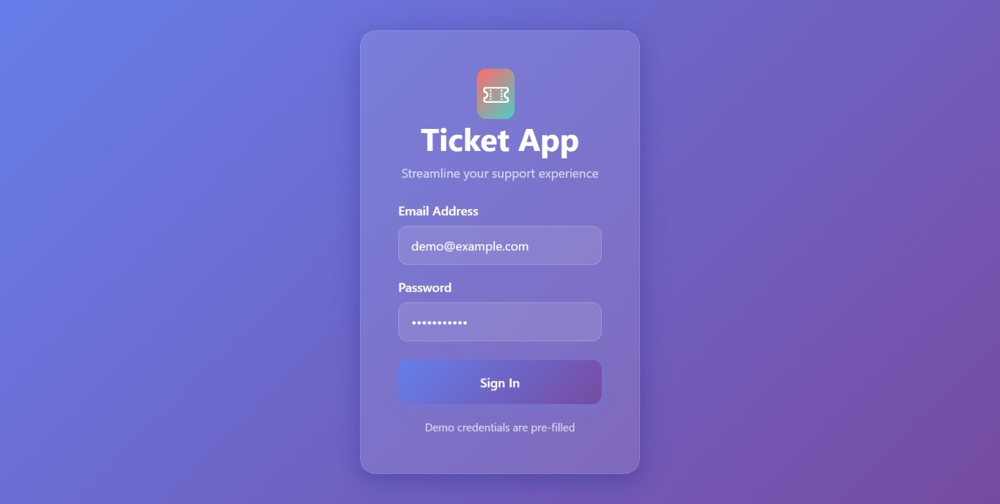
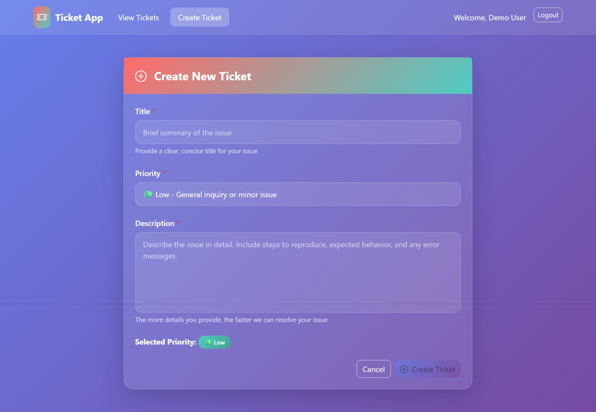
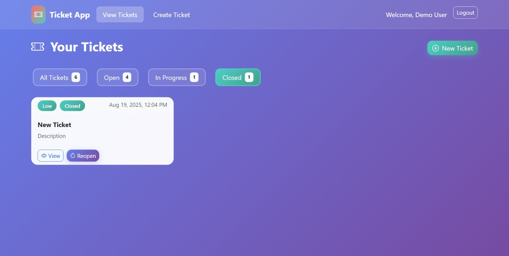
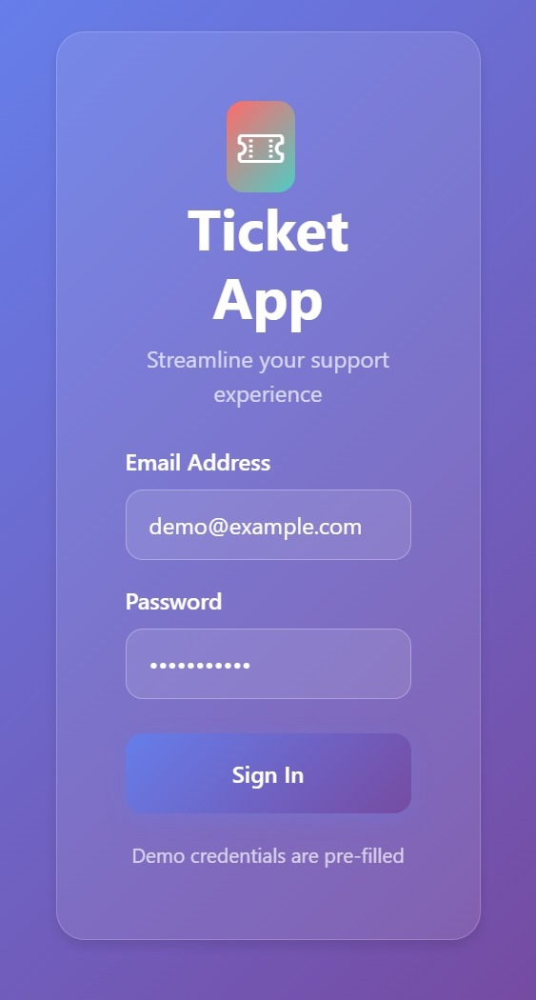
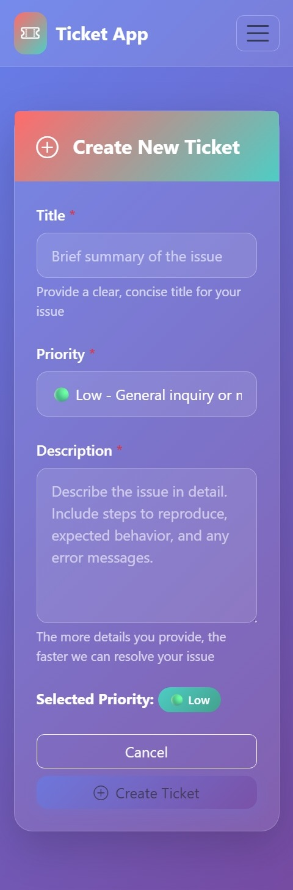
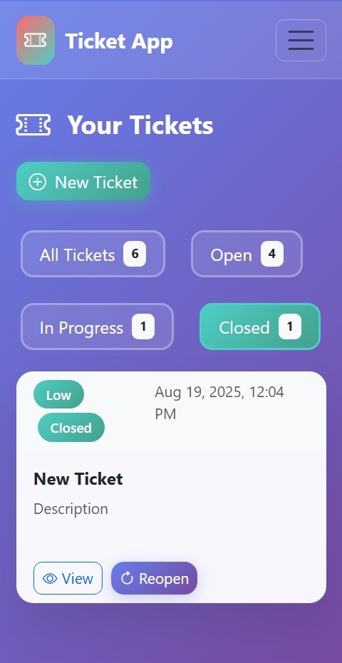

# Frontend - Ticketing App
A responsive ticketing system frontend built with **React**, **Bootstrap**, and **Axios**, designed to provide a seamless user experience across both desktop and mobile devices.

##  Deployment
This project is deployed on **Vercel**.  
[Live Demo](https://ticketing-frontend-hazel.vercel.app/)  

---

##  Tech Stack
- **React** – Component-based UI library
- **Bootstrap** – Responsive and mobile-first design framework
- **Axios** – Promise-based HTTP client for API communication

---

##  Features
- Create, view, and manage tickets
- Responsive design for both desktop and mobile
- Real-time updates using API calls
- Clean and intuitive UI

---

## 📸 Screenshots

###  Desktop Views
  
*Login Form*  

  
*Ticket Creation Form*  

  
*Ticket Details View*  

---

### Mobile Views
  
*Login Form (Mobile)*  

  
*Ticket Creation (Mobile)*  

  
*Ticket Details (Mobile)* 

##  Project Structure
```
frontend/
│── public/              # Static files (index.html, icons, etc.)
│── src/                 # Main source code
│   ├── components/      # Reusable UI components (Navbar, Forms, etc.)
│   ├── context/         # Context API for global state management
│   ├── services/        # API calls using Axios
│   ├── App.js           # Root application component
│   └── index.js         # Entry point for React DOM rendering
│
├── .env                 # Environment variables
├── package.json         # Dependencies and scripts
├── README.md            # Documentation
└── node_modules/        # Installed dependencies
```

---

## 🔧 Setup Instructions

### Prerequisites
- **Node.js** (v14 or higher)
- **npm** or **yarn**
- **Git**

### 1. Clone the Repository
```bash
git clone https://github.com/Prakashkumarkutty/ticketing-app.git
cd frontend
```

### 2. Install Dependencies
Using npm:
```bash
npm install
```

Or using yarn:
```bash
yarn install
```

### 3. Environment Configuration
Create a `.env` file in the root directory and add your environment variables:
```env
REACT_APP_API_BASE_URL=http://localhost:5000/api
```

**Note:** Replace the API URL with your backend server URL.

### 4. Start the Development Server
Using npm:
```bash
npm start
```

Or using yarn:
```bash
yarn start
```

The application will open automatically at `http://localhost:3000`

### 5. Build for Production
To create an optimized production build:
```bash
npm run build
```

This creates a `build` folder with production-ready files.

### 6. Run Tests (Optional)
To run the test suite:
```bash
npm test
```

---

## Usage
1. **Create Tickets**: Use the ticket creation form to submit new tickets
2. **View Tickets**: Browse all tickets in the main dashboard
3. **Manage Tickets**: Update ticket status, priority, and other details
4. **Responsive Design**: Access the system from any device

---

## API Integration
This frontend communicates with a backend API. Make sure your backend server is running and the `REACT_APP_API_BASE_URL` environment variable is set correctly.

Expected API endpoints:
- `GET /api/tickets` - Fetch all tickets
- `POST /api/tickets` - Create new ticket
- `PUT /api/tickets/:id` - Update ticket

---

##  Deployment on Vercel

### Quick Deploy
1. Push your code to a GitHub repository
2. Connect your GitHub account to Vercel
3. Import your repository
4. Add environment variables in Vercel dashboard
5. Deploy!

### Manual Deployment
```bash
# Install Vercel CLI
npm i -g vercel

# Deploy
vercel

# For production deployment
vercel --prod
```

---

## 🛠️ Development

### Available Scripts
- `npm start` - Runs the app in development mode
- `npm test` - Launches the test runner


### Code Style
This project uses:
- ESLint for code linting
- Prettier for code formatting
- Bootstrap for consistent styling

---

